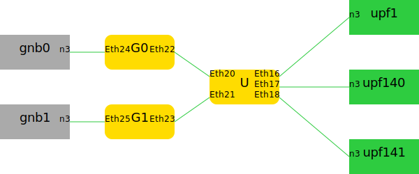

# Phones and Vehicles, 3-Slice with 3 UPFs

## Description

There are three slices and three Data Networks:

* sst=1, sd=0x000000, dnn=internet: generic cellphone, `10.1.0.0/16`.
* sst=140, sd=0x000000, dnn=vcam: remote driving camera stream, `10.140.0.0/16`.
  * `+sst4` command line flag changes to sst=4.
* sst=141, sd=0x000000, dnn=vctl: remote driving control stream, `10.141.0.0/16`.
  * `+sst4` command line flag changes to sst=4.

Each Data Network is served by a dedicated UPF.
All control plane network functions are shared.

There are 6 phones and 2 vehicles, sharing 1 gNB.
These quantities can be adjusted via command line flags.


## Basic Usage

Generate Compose file:

```bash
cd ~/5gdeploy/scenario
./generate.sh 20230817 --ran=ueransim

# adjust gNB and UE quantities
./generate.sh 20230817 +gnbs=2 +phones=48 +vehicles=12 --ran=ueransim
```

Open5GCore gNB simulator allows up to 2 slices so that it is incompatible with this scenario that has 3 slices.
If you want to run with Open5GCore gNB simulator, add `+sst4` flag to change SSTs:

```bash
./generate.sh 20230817 +sst4 --ran=phoenix
```

The Compose context is created at `~/compose/20230817`.
See [scenario general README](../README.md) on how to interact with the Compose context.

## Traffic Generation

See [trafficgen](trafficgen.md) for suggestions on how to generate traffic in this scenario.

## Multi-Host Usage

This scenario can be deployed onto multiple hosts, over Ethernet and VXLAN bridges.
See [multi-host](../../docs/multi-host.md) for more details.

## SONiC Switch QoS Setting

This scenario supports QoS enforcement when the N3 network is on a [SONiC](https://github.com/sonic-net/SONiC) Ethernet switch, for both downlink and uplink directions.



The diagram shows the required wiring, in particular:

* N3 interface of each gNB and UPF binds to a physical Ethernet adapter.
* Each gNB has its own VLAN *Gn*, in additional to VLAN *U* as the "central N3 switch".

The wiring and VLAN setup must be complete before applying configuration patches generated by the below scripts.

### Downlink QoS

`sonic-dl.ts` generates downlink QoS configuration.
Sample commands:

```bash
# view help
$(corepack pnpm bin)/tsx 20230817/sonic-dl.ts --help

# configure downlink QoS
$(corepack pnpm bin)/tsx 20230817/sonic-dl.ts --format=shell \
  --gnb=Ethernet20 --gnb=Ethernet21 --upf1=Ethernet16 --upf140=Ethernet17 --upf141=Ethernet18 \
  --rate=1000 --sched=DWRR --w1=20 --w140=30 --w141=50
```

Traffic classification is based on ingress switchport:

* Packets from UPF1 are assigned TC 2 (low priority).
* Packets from UPF140 are assigned TC 1 (medium priority).
* Packets from UPF141 are assigned TC 0 (high priority).

`--gnb` should be VLAN *U* switchports that lead to gNBs (not VLAN *Gn* switchports).
Rate shaping and QoS scheduler are applied to these ports.

### Uplink QoS

`sonic-ul.ts` generates uplink QoS configuration.
Sample commands:

```bash
# view help
$(corepack pnpm bin)/tsx 20230817/sonic-ul.ts --help

# configure uplink QoS
$(corepack pnpm bin)/tsx 20230817/sonic-ul.ts --format=shell \
  --gnb=Ethernet24 --n3=Ethernet22 --gnb=Ethernet25 --n3=Ethernet23 \
  --rate=1000 --sched=DWRR --w1=20 --w140=30 --w141=50
```

`--gnb` should refer to VLAN *Gn* switchport connected to gNB, `--n3` should refer to VLAN *Gn* switchport connected to VLAN *U*; these two flags should have the same repetitions.
Rate shaping and QoS scheduler are applied to `--n3` ports.

Traffic classification is based on DSCP field in the IPv4 header of ingress packets:

* Packets to UPF1 should have been tagged with DSCP=8, which are assigned TC 2 (low priority).
* Packets to UPF140 should have been tagged with DSCP=32, which are assigned TC 1 (medium priority).
* Packets to UPF141 should have been tagged with DSCP=40, which are assigned TC 0 (high priority).

gNB container is expected to perform DSCP tagging.
Currently this is only implemented in Open5GCore gNB container, which can be activated by passing these flags to netdef-compose:

```text
--phoenix-gnb-to-upf-dscp='upf1=8'
--phoenix-gnb-to-upf-dscp='upf140=32'
--phoenix-gnb-to-upf-dscp='upf141=40'
```
