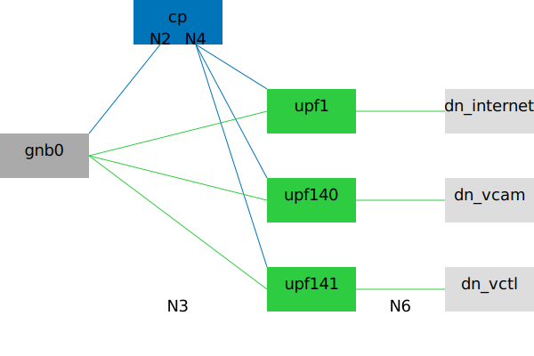

# Phones and Vehicles, 3-Slice with 3 UPFs

## Description

There are three slices and three Data Networks:

* sst=1, sd=0x000000, dnn=internet: generic cellphone, `10.1.0.0/16`.
* sst=140, sd=0x000000, dnn=vcam: remote driving camera stream, `10.140.0.0/16`.
* sst=141, sd=0x000000, dnn=vctl: remote driving control stream, `10.141.0.0/16`.

Each slice is served by a dedicated UPF.
All control plane network functions are shared.

There are 6 phones and 2 vehicles, sharing 1 gNB.
These quantities can be adjusted via command line flags.



## Basic Usage

Generate Compose file:

```bash
cd ~/5gdeploy/scenario
./generate.sh 20230817 --ran=ueransim
# --ran=ueransim is required.
# Open5GCore gNB simulator allows up to 2 slices so it is incompatible.
#
# Add --up=free5gc to select free5GC UPF instead of Open5GCore UPF.

# adjust gNB and UE quantities
./generate.sh 20230817 +gnbs=2 +phones=48 +vehicles=12 --ran=ueransim
```

The Compose context is created at `~/compose/20230817`.
See [scenario general REAMDE](../README.md) on how to interact with the Compose context.

## Traffic Generation

See [trafficgen](trafficgen.md) for suggestions on how to generate traffic in this scenario.

## Multi-Host Usage

In this sample, we run Control Plane on primary host, User Plane and RAN on secondary host.

```bash
# define variables for SSH control IPs
CTRL_UP=192.160.60.2

# define variables for experiment network IPs
EXP_CP=192.168.60.1
EXP_UP=192.168.60.2

# generate Compose file
./generate.sh 20230817 --ran=ueransim \
  --bridge=n2,vx,$EXP_CP,$EXP_UP \
  --bridge=n3,vx,$EXP_CP,$EXP_UP \
  --bridge=n4,vx,$EXP_CP,$EXP_UP \
  --place="+(dn|upf|gnb|ue)*@$CTRL_UP"

# upload Compose file and config folder to the secondary host
../upload.sh ~/compose/20230817 $CTRL_UP

# start the scenario
~/compose/20230817/compose.sh up

# stop the scenario
~/compose/20230817/compose.sh down
```

## Physical Ethernet Ports

It is possible to use physical Ethernet ports in select network functions.
This would allow, for example, QoS enforcement through hardware switches.

```bash
# define variables for host interface MAC addresses
MAC_N3_GNB0=02:00:00:03:00:01
MAC_N3_GNB1=02:00:00:03:00:02
MAC_N3_UPF1=02:00:00:03:00:03
MAC_N3_UPF140=02:00:00:03:00:04
MAC_N3_UPF141=02:00:00:03:00:05

# generate Compose file with physical ports support
./generate.sh 20230817 +gnbs=2 +phones=48 +vehicles=12 --ran=ueransim \
  --bridge=n3,eth,gnb0=$MAC_N3_GNB0,gnb1=$MAC_N3_GNB1,upf1=$MAC_N3_UPF1,upf140=$MAC_N3_UPF140,upf141=$MAC_N3_UPF141
```

See [netdef-compose READMD](../../netdef-compose/README.md) for more details.
