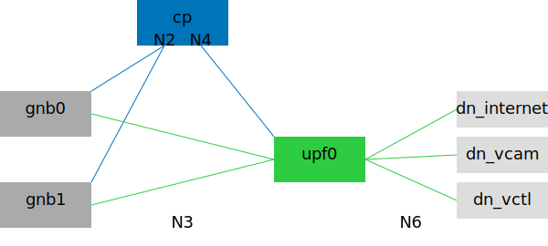

# Phones and Vehicles, 2-Slice with 1 UPF

## Description

This scenario has the same slices and Data Networks as [20231017](../20231017/), but with upf1+upf4 replaced with upf0.
It is intended for UPF benchmark and comparison.



## Basic Usage

Generate Compose file:

```bash
cd ~/5gdeploy/scenario
./generate.sh 20231214 +gnbs=2 +phones=2 +vehicles=2
```

While the script defaults to 1 gNB due to code reuse, it is recommended to adjust these quantities.
This helps ensure the bottleneck is in UPF being measured, instead of RAN simulators.

The Compose context is created at `~/compose/20231214`.
See [scenario general README](../README.md) on how to interact with the Compose context.

## Choose 5G Implementations

You can choose any combination of 5G implementations as described in [netdef-compose README](../../netdef-compose/README.md).

For highest throughput among RAN simulators, choose `--ran=packetrusher`.
However, it has a major limitation that each gNB can support only one UE with only one usable PDU session.
Thus, you would need to adjust quantities to satisfy (1) `+gnbs` equals `+phones` (2) `+vehicles` is zero.

```bash
cd ~/5gdeploy/scenario
./generate.sh 20231214 +gnbs=6 +phones=6 +vehicles=0 \
  --cp=free5gc --up=free5gc --ran=packetrusher
```

## Traffic Generation

See [trafficgen](../20230817/trafficgen.md) for suggestions on how to generate traffic in this scenario.
